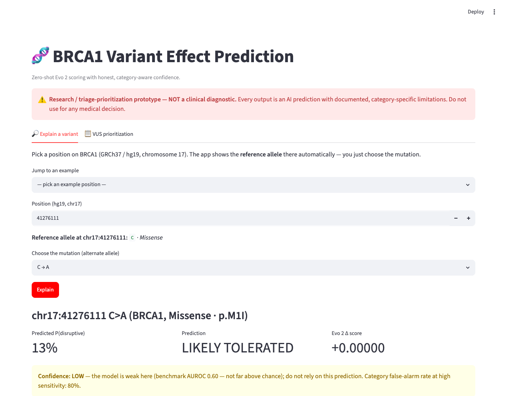
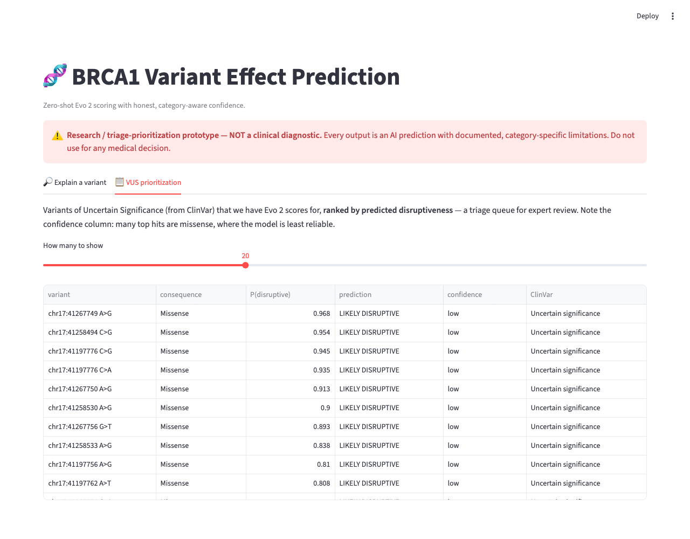

# Genomic Variant Effect Prediction — Hereditary Cancer Risk (BRCA1)

> **⚠️ Not a clinical diagnostic.** This is a research / triage-prioritization
> proof-of-concept. It is intended to help *prioritize* uncertain genetic variants
> for expert review and to study a genomic foundation model's real-world behavior —
> **not** to diagnose disease or guide any medical decision. Every output is an
> AI prediction with documented, category-specific limitations.

A portfolio-quality POC that uses the **Evo 2** genomic foundation model (Arc Institute)
to score the pathogenicity of single-nucleotide variants in **BRCA1** via **zero-shot
delta-likelihood scoring**, then builds a validation + honesty layer on top that is rigorous
about where the model succeeds and fails.

New to this field? Start with **[PRIMER.md](PRIMER.md)** — a plain-language explanation of
genomic foundation models, zero-shot variant effect prediction, delta-likelihood scoring,
and why BRCA1 is the canonical test case.

---

## Problem statement

Most variants found in cancer-risk genes like BRCA1 are **Variants of Uncertain Significance
(VUS)** — we don't yet know if they're harmful. Experimentally testing each one is slow and
expensive. Can a foundation model trained on raw DNA *predict* which variants disrupt gene
function, well enough to help **triage** which VUS deserve expert attention first?

## Approach (high level)

1. **Data layer** — reference BRCA1 region (chr17), the Findlay et al. (2018) saturation
   mutagenesis dataset (~3,893 SNVs with experimental function scores), and a slice of ClinVar.
2. **Zero-shot scoring** — for each variant, score the reference vs. variant sequence window
   with Evo 2 and compute `delta = var_log_prob - ref_log_prob`. More negative = more disruptive.
3. **Validation + honesty layer** *(the centerpiece)* — headline AUROC/AUPRC, then go further:
   per-category performance, false-positive rates, calibration, severity-dependent failure
   modes, and class-imbalance honesty.
4. **Push past zero-shot** — a lightweight supervised classifier on Evo 2 embeddings.
5. **Explanation layer** — plain-language, category-aware, uncertainty-honest per-variant output.
6. **Demo** — FastAPI + Streamlit VUS-prioritization view.

## Model access path

Evo 2 runs on a **cloud NVIDIA GPU via Modal** (the model is CUDA-only; Apple Silicon cannot
run it locally). We use the **1B model with FP8** on a cheap L4 GPU to stay within free-tier
budget. Full rationale, hardware findings, and licensing are documented in
**[docs/ACCESS_PATH.md](docs/ACCESS_PATH.md)**.

## Key results & honest limitations

The point of this project is not the headline number — it's the rigorous, honest accounting of
where the model works and fails (full writeup: **[RESULTS.md](RESULTS.md)**).

- **Reproduced the published benchmark:** zero-shot AUROC **0.737** (LOF vs FUNC), matching the
  reported Evo 2 1B ≈ 0.73 — validating the whole pipeline.
- **The aggregate hides the important weakness:** within **missense** variants (the bulk of real
  VUS) AUROC drops to **0.604** — the pooled number was inflated by easy between-category signal.
- **Poor precision under imbalance:** at 90% sensitivity, ~**2.9 false alarms per true hit**.
- **Severity-dependent failure:** worse on mild (0.70) than severe (0.78) loss-of-function.
- **Honest benchmark:** the 1B zero-shot score is **beaten by CADD (0.82) and even conservation
  (phyloP, 0.79)** on this dataset — with fair caveats (1B is the budget model; the 40B scores
  ~0.87+; Evo 2 is zero-shot vs. their supervised training).

The explanation layer turns this into per-variant **category-aware confidence**: e.g. a confident
missense prediction is flagged "low trust — do not rely," because that's where the model is weakest.

## Status

| Milestone | Description | Status |
|---|---|---|
| 0 | Scaffolding, primer, access-path research | ✅ done |
| 1 | Data layer (Findlay + ClinVar + reference) | ✅ done |
| 2 | Core zero-shot scoring engine | ✅ done (AUROC 0.74, matches published ~0.73) |
| 3 | Validation + honesty layer | ✅ done (see [RESULTS.md](RESULTS.md)) |
| 4 | Embedding-based classifier | ⏸️ deferred (engine ready; paused on cloud budget) |
| 5 | Explanation layer | ✅ done (trust-aware per-variant explanations) |
| 6 | Demo app + packaging | ✅ done (FastAPI + Streamlit) |

## Quickstart

```bash
make setup      # create venv + install local deps
make data       # [M1] fetch + build datasets (CPU, ~1 min)
# [M2] scoring runs on a Modal GPU (see docs/ACCESS_PATH.md):
#   modal run --detach -m gvep.scoring.modal_app::main
make sanity     # [M2] delta distributions + quick AUROC
make validate   # [M3] honesty layer -> RESULTS.md + results/figures/
make explain    # [M5] demo per-variant trust-aware explanations
make api        # [M6] FastAPI backend at http://localhost:8000/docs
make ui         # [M6] Streamlit demo UI
```

## Demo

- **API:** `make api` → interactive docs at `http://localhost:8000/docs`.
  - `GET /explain?pos=41267740&ref=T&alt=A` → trust-aware explanation
  - `GET /prioritize?top=20` → VUS triage queue ranked by predicted disruptiveness
- **UI:** `make ui` → enter a variant and see score + calibrated probability + category-aware
  confidence, plus a VUS-prioritization table. (Operates on the ~3,900 benchmark variants.)

### Screenshots

*Explain a variant — note the honesty layer: the model predicts "LIKELY TOLERATED," but flags
**LOW confidence** because this is a missense variant where it's near-chance:*



*VUS prioritization — uncertain variants ranked by predicted disruptiveness, with confidence:*



## What I learned

- **Foundation-model variant scoring end to end:** Evo 2 access paths, FP8/Transformer-Engine
  hardware constraints, zero-shot delta-likelihood scoring, and embedding extraction.
- **Cloud GPU engineering on a budget:** building a finicky CUDA image on Modal, caching weights
  on a Volume, and making jobs **resilient** (server-side persistence + `--detach`) after budget
  caps and dropped connections taught hard lessons.
- **Evaluation rigor as the real product:** AUROC vs AUPRC, bootstrap CIs, stratified evaluation,
  calibration (and catching a base-rate-collapse bug), operating points, and class-imbalance
  honesty — plus benchmarking against established tools instead of grading on a curve.
- **Responsible ML framing:** separating *prediction* from *confidence*, and refusing to claim a
  confidence the data can't support.

Full reflection in **[LEARNINGS.md](LEARNINGS.md)**; ready-to-use project blurbs in
**[docs/portfolio_blurb.md](docs/portfolio_blurb.md)**.

## Repository layout

```
src/gvep/          installable package
  data/            dataset fetchers + loaders (M1)
  scoring/         Evo 2 / Modal delta-likelihood + embedding engine (M2, M4)
  analysis/        metrics, calibration, honesty layer, classifier (M3, M4)
  explain.py       trust-aware per-variant explanation layer (M5)
  app/             FastAPI backend + Streamlit UI (M6)
  utils/           seeding, config helpers
data/              raw/ processed/ cache/  (gitignored; regenerable)
results/           figures/ + metrics/ (key plots committed for portfolio)
docs/              ACCESS_PATH.md (Evo 2 access + hardware decision record)
RESULTS.md         the honesty-layer findings writeup (M3)
NOTES.md           running biology + ML learning log
PRIMER.md          newcomer's conceptual primer
```

## Attribution

- **Evo 2** — Arc Institute, NVIDIA, and collaborators. Model + weights are Apache-2.0.
  Brixi et al., *"Genome modeling and design across all domains of life with Evo 2"*, Nature (2026).
- **Findlay et al. (2018)** — *"Accurate classification of BRCA1 variants with saturation
  genome editing"*, Nature. Data via MaveDB `urn:mavedb:00000045-b`.
- **ClinVar** — NCBI.

## License

MIT (this project's code). See [LICENSE](LICENSE) for third-party component licenses.
